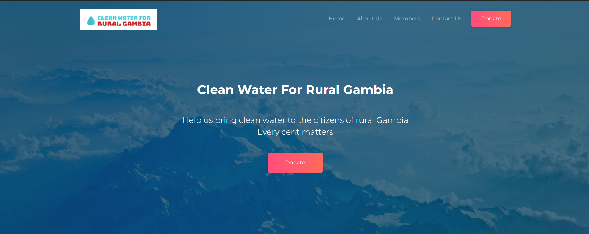
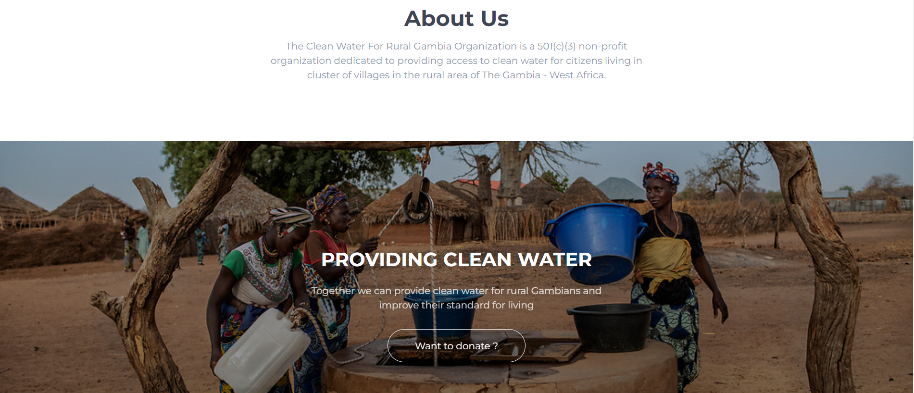

### Clean Water For Rural Gambia Website

## Portfolio Website

## About Project

Static website build for a non-profit organization committed to providing access
to clean water for rural Gambians
[explore site](https://cleanwaterforruralgambia.web.app/)
            
## Technologies utilised

  
  
  
  
  
  

### Hero

### About

## License 

This project is licensed under [`MIT`](LICENSE)

## Version 
1.0.0
